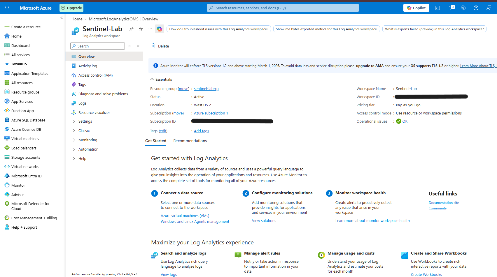
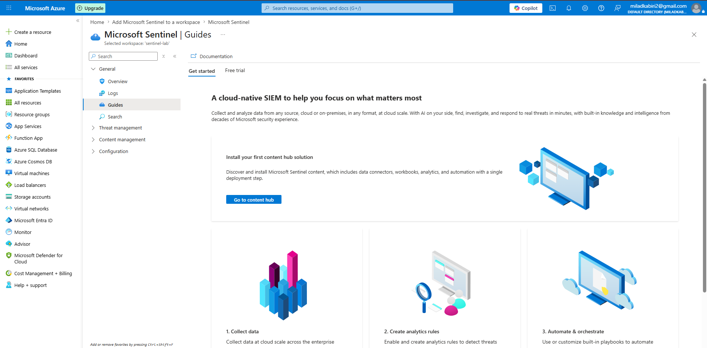

# Azure Sentinel SIEM Lab

## Overview

This project demonstrates the deployment and configuration of Microsoft Sentinel and Azure Log Analytics Workspace for cloud-based security monitoring and threat detection.

The objective of this lab was to gain hands-on experience with Microsoft Sentinel, log collection, security monitoring, and Kusto Query Language (KQL).

---

## Technologies Used

- Microsoft Azure
- Microsoft Sentinel
- Azure Monitor
- Log Analytics Workspace
- Kusto Query Language (KQL)

---

## Lab Environment

### Resource Group

Sentinel-Lab-RG

### Log Analytics Workspace

Sentinel-Lab

### SIEM Platform

Microsoft Sentinel

---

## Tasks Completed

### 1. Log Analytics Workspace Deployment

Created a Log Analytics Workspace named:

- Sentinel-Lab

Verified successful deployment and operational status.

---

### 2. Microsoft Sentinel Deployment

Enabled Microsoft Sentinel on the Log Analytics Workspace.

Verified successful onboarding and configuration.

---

## Screenshots

### Log Analytics Workspace

### Microsoft Sentinel Enabled

---

## Skills Demonstrated

- SIEM Administration
- Cloud Security Monitoring
- Azure Security Operations
- Log Management
- Security Event Analysis
- Threat Detection Fundamentals

---

## Future Enhancements

- Connect Microsoft Entra ID Logs
- Configure Data Connectors
- Develop KQL Queries
- Create Analytics Rules
- Generate Security Incidents
- Threat Hunting Exercises

---
